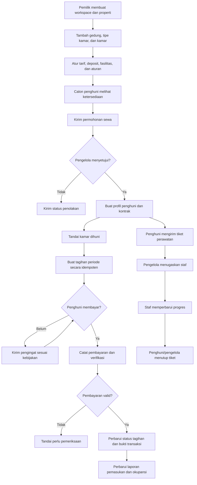

# KosManager — Flowchart proses utama

```mermaid
flowchart TD
  A["Pemilik membuat workspace dan properti"] --> B["Tambah gedung, tipe kamar, dan kamar"]
  B --> C["Atur tarif, deposit, fasilitas, dan aturan"]
  C --> D["Calon penghuni melihat ketersediaan"]
  D --> E["Kirim permohonan sewa"]
  E --> F{"Pengelola menyetujui?"}
  F -->|Tidak| G["Kirim status penolakan"]
  F -->|Ya| H["Buat profil penghuni dan kontrak"]
  H --> I["Tandai kamar dihuni"]
  I --> J["Buat tagihan periode secara idempoten"]
  J --> K{"Penghuni membayar?"}
  K -->|Belum| L["Kirim pengingat sesuai kebijakan"]
  L --> K
  K -->|Ya| M["Catat pembayaran dan verifikasi"]
  M --> N{"Pembayaran valid?"}
  N -->|Tidak| O["Tandai perlu pemeriksaan"]
  N -->|Ya| P["Perbarui status tagihan dan bukti transaksi"]
  P --> Q["Perbarui laporan pemasukan dan okupansi"]
  H --> R["Penghuni mengirim tiket perawatan"]
  R --> S["Pengelola menugaskan staf"]
  S --> T["Staf memperbarui progres"]
  T --> U["Penghuni/pengelola menutup tiket"]
```
